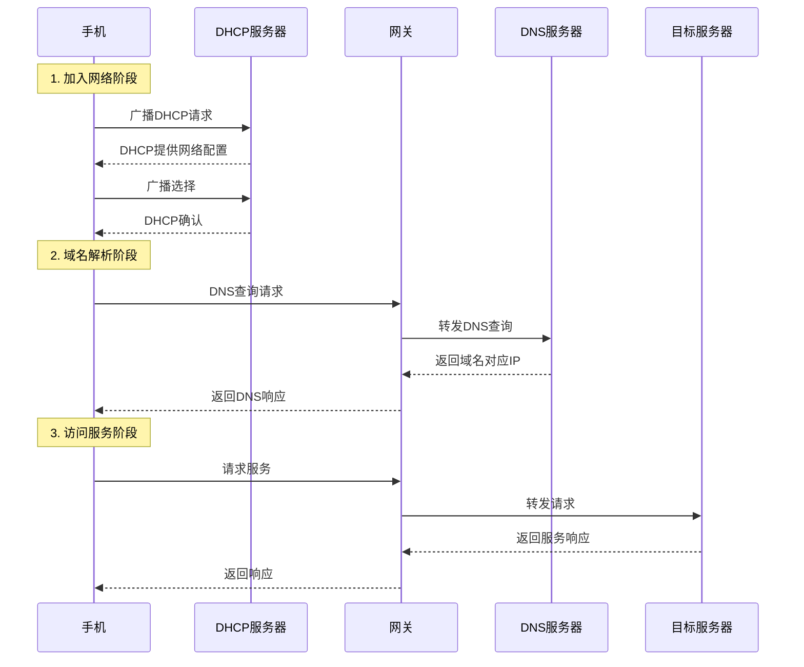

讲讲常见的DNS劫持的事情

<!--more-->

# 第一现场

最近看到一个同学在宿舍里打开学校APP的某个服务时，本来应该访问对应的网页，但却打开了另一个显然与学校无关的钓鱼网站，并表示学校APP没写好。那这到底是什么情况呢？我的第一直觉是DNS劫持，毕竟这是在我印象中普通人最常遇见的中招方式。但我想探究一下，也借此回顾一下已经基本忘记的计算机网络知识。首先要强调的是，网络和安全都非常复杂，我们只探讨一个通用攻击可能的情况。

众所周知，计算机网络通信是基于TCP/IP协议栈的，也就是说，**要访问一个网络服务，必须知道该服务的IP地址**（和端口号，但本文也把它算在IP地址里）。
所以这个同学遇到的问题我们可以收束为访问了恶意服务IP地址。
那么他的设备是怎么得到这个恶意服务IP地址的呢？

# 流程分析

## 加入网络阶段
一般来说病毒不会专门去篡改一个学校APP，我们可以假设APP代码、配置的服务地址是不含这个恶意服务IP地址的。
不过APP里也没有正确的IP地址。
给APP配置服务地址，一般来说会用域名而不是IP地址，因为IP很容易随硬件更新、网络架构优化、故障等发生变动，如果把IP地址硬编码在代码里，在IP变化时就需要更新代码，增加维护复杂性。

通过域名访问服务时，计算机先会看本地有没有域名IP对应表，具体位置一是没过期的缓存，二是手动配置文件，比如hosts、网卡配置、APP配置等等。修改这些文件需要管理员权限，在Windows电脑上很容易不小心给恶意程序提升权限，但是在未越狱的现代手机操作系统上非常难，我们基本可以排除本地文件被篡改。

对于访问不常用的学校APP里的服务这种场景，显然，本地应该没有保存服务器域名对应的IP。这时，手机会将域名发给一个专门记录和管理域名IP对应关系的服务器，请求返回对应的IP地址。这个专用服务器就是DNS（Domain Name System，域名系统）服务器。

那么计算机怎么知道DNS服务器的IP地址呢？
首先是看本地有没有手动指定，没有特殊原因，一般人不会去手动指定。
然后是看在连接校园局域网时设备从DHCP服务器获取到的网络配置信息。DHCP是指动态主机配置协议（Dynamic Host Configuration Protocol），主要作用是自动化配置网络，毕竟手动配置网络信息非常麻烦，移动设备还经常在不同网络间切换，自动化可以大大降低网络管理员工作压力。
整个工作流程是，设备连接到网络后，会广播DHCP请求，DHCP服务器接收到请求后会返回指定给该设备的IP地址、网关地址、DNS服务器地址等网络配置信息。

在这个环节里，如果有伪造的DHCP服务器响应了请求，计算机就会被配置上恶意的DNS服务器地址。但是，同样由于手机的安全性，一般很难本地运行一个可接收请求的DHCP服务器，而交换机一般也会配置上DHCP嗅探防护，即预先标记好合法DHCP服务器所在的端口，如果从其他端口收到DHCP响应包就会丢弃掉，所以被DHCP欺骗可能性也不大。
如果DHCP很罕见地没有返回DNS服务器地址，那计算机会使用网关IP作为DNS地址，网关收到DNS请求后会转发给自己在加入网络时获得的DNS服务器地址。在本文场景下，如果校园网网关存储DNS是恶意的，那应该所有通过这个网关上网的人都会收到恶意IP，但只有这个同学，所以也不是这个情况。

## 域名解析阶段
这样计算机就获得了正确的DNS服务器地址，接下来就会向这个DNS服务器发送域名解析请求。这个请求首先发给网关，由网关转发给DNS。
为什么要先发给网关呢？因为普通用户设备是校园网最大的风险来源，需要与重要服务隔离在不同的子网，通过网关进行中转访问便于安全防护。
那么计算机怎么知道网关的IP地址呢？前面提到的DHCP服务会返回网关地址，计算机会把这个地址保存下来作为默认网关。考虑到前面已经认为DHCP基本无法欺骗，网关地址也是正确的。

接下来网关收到DNS请求包后会转发给DNS服务器，DNS服务器收到请求包后会查找域名对应的IP地址。
在校园网环境下，为了防止校外用户访问校内资源、屏蔽网站等等，一般会自建DNS服务器，这时管理员很可能把域名和IP的对应关系写死，防止被投毒篡改。而且如果被篡改，也不会只有一个用户受到影响。所以可以认为DNS功能正常，可以返回正确的IP地址。

## 访问服务阶段
DNS把响应包交给网关，网关发给手机。手机收到响应包后，获得了正确的IP地址，然后就可以访问对应服务了。

这样就算梳理一遍基本流程了，画个时序图。

# 知道IP还不够
这样看下来似乎都很安全，但这个同学还是访问到恶意网站了。
我们可以开始质疑这一切推论的起点了。
知道正确IP地址就一定能访问正确服务吗？不一定。
在局域网内，数据包的传输是基于MAC地址进行的，而不是IP地址，这是一个历史包袱，最开始底层硬件只认MAC地址，后来为了多个局域网之间能通信才设计了IP协议。总之，当设备的网络适配器发送数据包时，它需要知道目标MAC地址才能正确地将数据包发送到目标网络适配器。
为了在获得网关IP地址后进一步得到网关的MAC地址，手机需要先发送ARP（Address Resolution Protocol，地址解析协议）广播问“谁的IP是这个、你的MAC地址是多少”，网关收到ARP请求后会回复自己的MAC地址，手机会将其缓存在本地，之后发送服务请求时直接使用MAC地址送到网关。

那么问题来了，如果局域网内有恶意设备，它可以在收到ARP广播时不假思索抢先发送伪造的ARP响应，告诉手机“网关的MAC地址是我的MAC地址”，这样手机就会把发给网关的数据包发给这个恶意设备。这个恶意设备收到数据包后，可以选择转发给真正的网关（中间人攻击），也可以直接响应一个恶意服务IP地址的数据包（DNS劫持），这样手机就会访问到恶意服务了。

不巧的是，为了防范用户之间的通信引起更大的安全问题，校园网交换机一般会直接隔离所有用户设备，禁止用户设备之间通信，只允许用户设备与DHCP、DNS、校园服务等特定服务器通信，同时也开启了ARP防护功能，只允许网关所在的端口传来的ARP响应可以被通过。这样一来，手机接收到的网关MAC地址应该是正确的，不会被恶意设备篡改。

# 走进科学
经过前面的分析，我们排除了很多可能性，回顾场景，还有一个关键词没考虑，“宿舍”。现代学生往往不止拥有一个联网设备，为了便捷入网、稳定信号、控制延迟等，很多同学会购买小型路由器再创建一个个人局域网，让所有设备连接到这个路由器上，再由路由器连接到校园网。这个路由器在安全配置上往往相当宽松，默认不会启用设备隔离，也往往不会有ARP防护等功能。这样一来，在这个个人局域网内，恶意设备（在宿舍环境一般来说就是中了病毒的设备，甚至有可能就是本机）就可以轻易地进行ARP欺骗，篡改手机中记录的网关MAC地址，让设备将服务请求发送给恶意设备。后面就非常简单了，恶意设备收到请求后直接响应一个恶意服务IP地址的数据包，手机就访问到了钓鱼网站。

| 安全功能 | 校园网主干 | 宿舍子网  |
| -------- | ---------- | --------- |
| 设备隔离 | ✔️严格启用  | ❌默认关闭 |
| ARP防护  | ✔️可能启用  | ❌基本没有 |
| DHCP防护 | ✔️可能启用  | ❌基本没有 |

# 安全启示
所以，安全是一个完整的链条，即使校园网主干做得非常安全，末端设备的薄弱仍然可能让努力付诸东流。

todo 计算机、手机、设备混用
todo 网关、交换机混用
todo 把段落写成列表，流程更清晰
todo 拓扑图

# 写作背后的思考
这个选题也不够好。我会不停想到别的可能性但是又不想展开讲，让整篇文章越来越乱

然后其实听到这个同学的问题时，冲浪多的人一般第一时间就会想到DNS劫持，但我为了回顾网络知识，硬生生扯了这么多，最后才回归到DNS劫持并且几句话讲完，个人感觉是非常虎头蛇尾的。

我觉得还是有一个非常具体、可以在手上直接探索的问题比较好写，可以边探索边写，写的时候也不会偏离主题太远，毕竟目标就是解决问题。